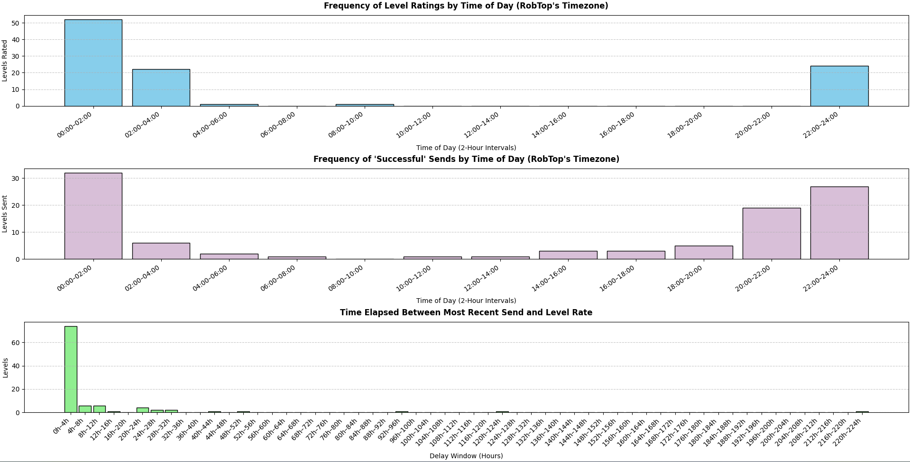

# Send/Rate Stats Collector

Collects data regarding Geometry Dash levels and their send and rate timings. Used to inform research I'm doing regarding the rate system.

## Description

As a Geometry Dash Moderator, the way that levels are rated in Geometry Dash has always been a point of significance, and sometimes contention, for me and for many other community members. To give a bit of context (if you somehow find this and aren't familiar with Geometry Dash or its rating system), the game's primary focus is on creating and completing user-created levels. The game uses a rating system to reward high-quality levels with stars or moons, which players can gain upon completing those levels. Ratings are highly desirable as they provide players with an incentive to complete a creator's level, garnering the level more attention as well as serving as an official seal of approval from the creator of the game. These ratings are managed solely by RobTop, the game's creator. However, he relies on a team of roughly 80 in-game Moderators to suggest levels to him to be rated, which is referred to as "sending" a level. Every time a level is sent, it shows up at the top of a tab of levels that is publicly visible, known as the "Sent Tab". 

Over time, I've noticed a pattern where the time I send a level, and thus its placement in the Sent Tab at a given time, has a direct impact on its likelihood to be seen by RobTop. It's important to note that the game is massive, and hundreds of levels get sent per day. RobTop rates, on average, roughly 5-20 levels on a given day——sometimes less. Lately, I've been speaking to creators who have expressed frustration at how hard it is to get their level seen and how arbitrary the system is. Ideally, the system would be a lot more random, whereas the current system rewards keeping track of when RobTop typically rates levels and sending levels at a time where he is more likely to see them. It's possible to game the system to ensure all of your sends are as likely as possible to get levels rated, which brings a lot of unfairness to the system and also makes it difficult for me to have my sends be meaningful, as my free time doesn't really align with these "ideal times".

As for the program itself, it has a variety of features. Primarily, it scrapes rated levels from a spreadsheet (which I have downloaded and included as a file for ease of access and for optimization purposes, though this means it will have to be updated manually) and records data such as the time of its most recent send, the time it was rated, and how long it took to be rated. There are different patterns depending on difficulty (Demon levels, the hardest difficulty, have their own system for being seen by RobTop which appears to not have as much of a reliance on send timing), as well as the gamemode (Classic levels are the most prevalent and are the focus of my research, though Platformer levels, recently added in Update 2.2, appear to be checked by RobTop significantly less frequently and in a different manner). The script contains options to view statistics for these types of levels as well. It also allows for individual checking of a single (or multiple) user-inputted level IDs, as opposed to the levels scraped from the spreadsheet.

Level IDs are obtained from the spreadsheet by starting at the end (which contains the most recent IDs) and recording the IDs of the last 2 entries, then skipping back to the next multiple of 10 and repeating the process. IDs are only recorded if they fit the current filters. The list of level IDs is then passed into the SendDB API. This API provides info such as when all of a level's sends were (each moderator can send a level once, but this leads to a theoretical maximum of over 80 sends on a single level), as well as the time it was rated. Notably, the SendDB Discord bot, and its associated database, only started collecting data roughly 1.5 years ago, so this research is time-limited due to that.

There are also graphs generated from the data, which show what times levels are most likely to be rated at, what times their most recent send was at (as only the most recent send seems to matter, given the fact that every send pushes the level to the top of the Sent Tab), and the time difference between a level being sent and a level being rated. The data seem to heavily suggest that levels sent at certain times are significantly more likely to be rated, though more testing (and perhaps statistical analysis) could always be done.

## Getting Started

### Dependencies

* The program makes API requests using the requests library.
* The requests_cache library is used to cache SendDB API data for an hour to speed up testing.
* The pandas library is used to read data from the spreadsheet.
* Streamlit was used to create the frontend.
* Plotly.express is used to graph results and trends.

### Executing program

The program can be ran locally, though there is also a hosted version (link coming soon!)

## Example results

The following results were obtained using the statistics of 100 nondemon classic levels, scraped from the spreadsheet.

## Acknowledgments

* DomPizzie - [readme template](https://gist.github.com/DomPizzie/7a5ff55ffa9081f2de27c315f5018afc)
* [SorkoPiko](https://www.sorkopiko.com/) - creator of SendDB
* SolarPK - made me realize that SendDB even had an API, prompting the idea for the project and making it possible
* AndromedaMapping1 - creator of the [Rated Levels spreadsheet](https://docs.google.com/spreadsheets/d/1hzidRG2rq2LdeKY4kDndYUNpc_GVHFi1dICtQWCUsgc/edit?gid=23179898#gid=23179898) I used to scrape level IDs and info
* My Discord server, goober isle, for being the reason I cared about the rate system and the creators who get screwed over by it to the point where I wanted to do this